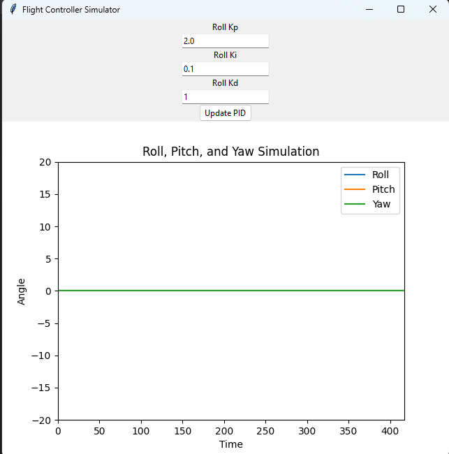

# Arduino Flight Controller

This project implements a simple flight controller for a quadcopter using an Arduino board and an MPU6050 sensor. The flight controller reads data from the MPU6050 to get the orientation (roll, pitch, yaw) and uses PID controllers to maintain stable flight.

## Table of Contents

- [Overview](#overview)
- [Hardware Requirements](#hardware-requirements)
- [Software Requirements](#software-requirements)
- [Circuit Diagram](#circuit-diagram)
- [Installation](#installation)
- [Configuration](#configuration)
- [Usage](#usage)
- [PID Tuning](#pid-tuning)
- [Contributing](#contributing)
- [License](#license)

## Overview



The Arduino flight controller is designed to stabilize a quadcopter by reading data from an **MPU6050** accelerometer and gyroscope sensor and using PID controllers to control the motor speeds. The code calculates roll, pitch, and yaw and adjusts the motor speeds to maintain stable flight.

## Hardware Requirements

- **Arduino Uno/Nano/Pro Mini** (or compatible board)
- **MPU6050** Accelerometer and Gyroscope Sensor
- **4 Brushless Motors** with Electronic Speed Controllers (ESCs)
- **Quadcopter Frame**
- **LiPo Battery**
- **Propellers**
- **RC Receiver and Transmitter** (for manual control)

## Software Requirements

- **Arduino IDE** (latest version) or any compatible IDE
- **MPU6050 Library**: Download from the Arduino Library Manager or from [GitHub](https://github.com/jrowberg/i2cdevlib/tree/master/Arduino/MPU6050)
- **PID Library**: Download from the Arduino Library Manager or from [Arduino PID Library](https://playground.arduino.cc/Code/PIDLibrary/)

## Circuit Diagram

Connect the MPU6050 sensor to the Arduino using the I2C protocol:

- **VCC** -> 3.3V or 5V
- **GND** -> GND
- **SCL** -> A5 (for Arduino Uno) or SCL pin
- **SDA** -> A4 (for Arduino Uno) or SDA pin

Connect each ESC signal wire to a separate PWM-capable digital pin on the Arduino (e.g., D9, D10, D11, D12).

## Installation

1. Install the **Arduino IDE** from the [official website](https://www.arduino.cc/en/software).
2. Install the required libraries:
   - Open the **Arduino IDE** and go to **Sketch** > **Include Library** > **Manage Libraries...**
   - Search for `MPU6050` and `PID` and install them.
3. Clone or download this repository:
   ```bash
   git clone https://github.com/yourusername/arduino-flight-controller.git

4. Open the /main/main.ino file in the Arduino IDE.


# Configuration
Before uploading the code to the Arduino board, you may need to adjust the PID constants (Kp, Ki, Kd) for roll, pitch, and yaw in the code to match your quadcopter's requirements.

# Usage
1. Connect the Arduino to your computer via USB.
2. Select the correct board and COM port in the Arduino IDE.
3. Click on Upload to upload the code to the Arduino.
4. Power up your quadcopter with a LiPo battery and use your RC transmitter to control it.

# PID Tuning
Tuning the PID controllers is crucial for stable flight. Start with small values for Kp, Ki, and Kd and gradually increase them while observing the quadcopter's response. You can use tools like PID Tuning Software to fine-tune the parameters.

# License
This project is licensed under the MIT License - see the LICENSE file for details.